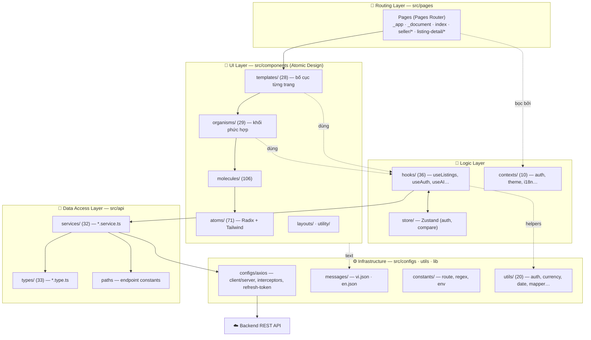
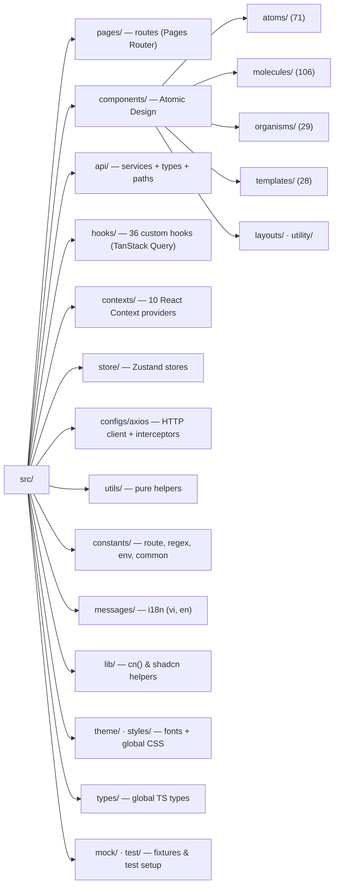
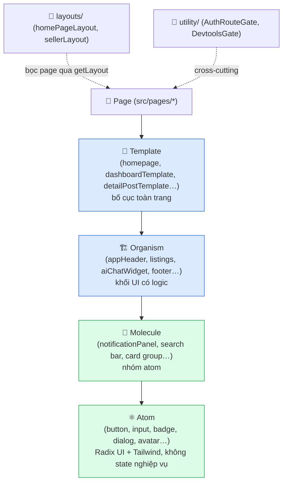
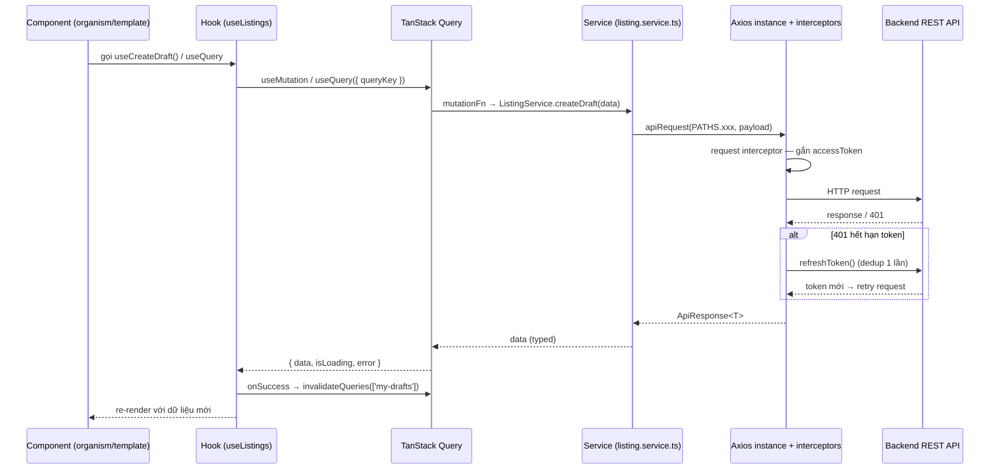
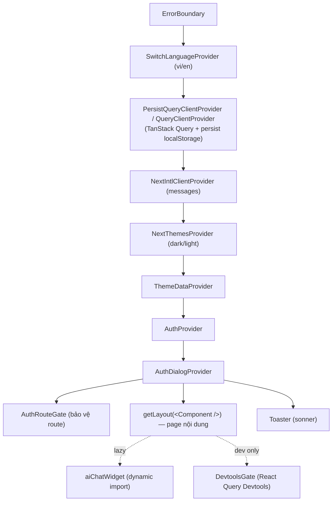
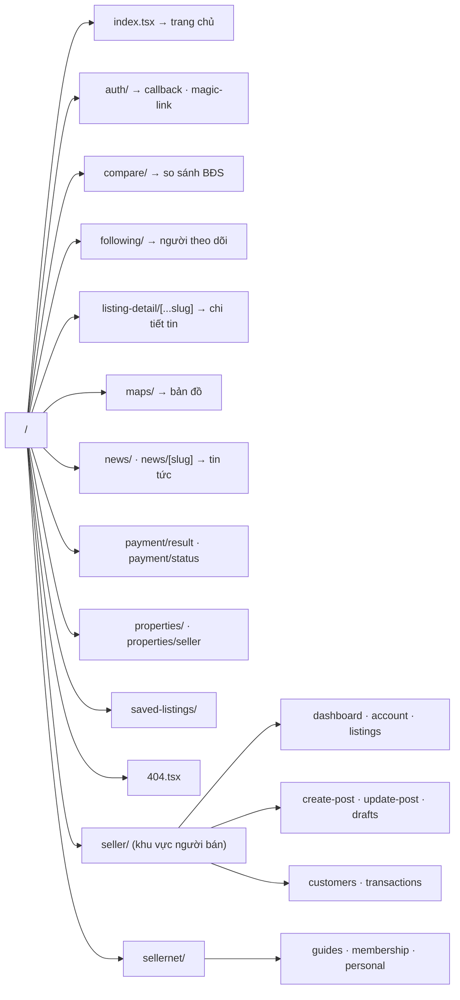
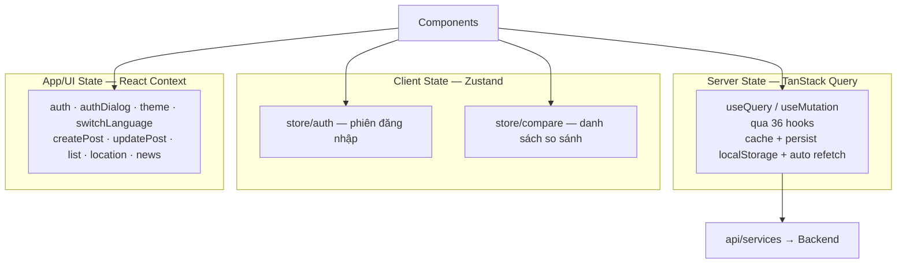

# SmartRent FE — Sơ đồ tổ chức mã nguồn

Tài liệu sơ đồ kiến trúc & tổ chức source code của webapp `smartrent-fe`.

> Stack chính: **Next.js 15 (Pages Router)** · **React 19** · **TypeScript** · **TanStack Query** (server state) · **Zustand** (client state) · **React Context** (auth/theme/i18n) · **Axios** (service layer) · **next-intl** (vi/en) · **Tailwind + Radix UI** · Atomic Design.

Các sơ đồ được viết bằng [Mermaid](https://mermaid.js.org/) — GitHub/VS Code (với extension Mermaid) render trực tiếp.

## Mục lục

1. [Kiến trúc phân lớp](#1-kiến-trúc-phân-lớp-layered-architecture)
2. [Cây thư mục `src/`](#2-cây-thư-mục-src)
3. [Atomic Design — phân tầng component](#3-atomic-design--phân-tầng-component)
4. [Luồng dữ liệu (Data Flow)](#4-luồng-dữ-liệu-data-flow)
5. [Cây Provider trong `_app.tsx`](#5-cây-provider-trong-_apptsx)
6. [Bản đồ Routing (Pages Router)](#6-bản-đồ-routing-pages-router)
7. [Quản lý State](#7-quản-lý-state)

---

## 1. Kiến trúc phân lớp (Layered Architecture)

Ứng dụng được tổ chức thành các lớp rõ ràng, dữ liệu chảy một chiều từ UI → hooks → service → API backend.

---

## 2. Cây thư mục `src/`

> Alias import: `@/*` → `./src/*` (xem `tsconfig.json`).

---

## 3. Atomic Design — phân tầng component

`src/components/` tuân theo Atomic Design: thành phần nhỏ ghép thành thành phần lớn hơn, template lắp vào page.

| Tầng         | Số lượng | Vai trò                                                         |
| ------------ | -------: | --------------------------------------------------------------- |
| `atoms/`     |       71 | UI nguyên thủy (button, input, dialog…) — chủ yếu wrap Radix UI |
| `molecules/` |      106 | Ghép nhiều atom thành đơn vị UI tái dùng                        |
| `organisms/` |       29 | Khối lớn có logic (header, listing list, AI chat)               |
| `templates/` |       28 | Bố cục từng loại trang, lắp organisms lại                       |
| `layouts/`   |        2 | Khung chung (home, seller) gắn qua `getLayout`                  |
| `utility/`   |        2 | Cross-cutting (gate auth, devtools)                             |

---

## 4. Luồng dữ liệu (Data Flow)

Ví dụ: thao tác đọc/ghi listing đi qua đủ các lớp.

**Nguyên tắc:**

- Component **không** gọi axios trực tiếp — luôn qua **hook**.
- Hook dùng **TanStack Query** để cache + đồng bộ server state; ghi xong `invalidateQueries`.
- **Service** là nơi duy nhất biết endpoint (`PATHS`) và kiểu dữ liệu (`*.type.ts`).
- **Interceptor** xử lý auth token + tự refresh khi 401 (có dedup tránh refresh đồng thời).

---

## 5. Cây Provider trong `_app.tsx`

Thứ tự bọc provider quyết định context khả dụng cho toàn app.

---

## 6. Bản đồ Routing (Pages Router)

`src/pages/` → URL theo cơ chế file-based của Next.js Pages Router.

> Đặc biệt: `_app.tsx` (root component + providers), `_document.tsx` (HTML shell). Dynamic routes: `[...slug]` (catch-all chi tiết tin), `[slug]` (news).

---

## 7. Quản lý State

Ba cơ chế state song song, mỗi loại cho một mục đích.

| Loại state       | Công cụ        | Dùng cho                                                        |
| ---------------- | -------------- | --------------------------------------------------------------- |
| **Server state** | TanStack Query | Dữ liệu từ API: listings, news, user… (cache, refetch, persist) |
| **Client state** | Zustand        | Trạng thái global nhẹ: auth session, danh sách so sánh          |
| **App/UI state** | React Context  | Theme, ngôn ngữ, dialog auth, flow tạo/sửa tin                  |

---

_Sơ đồ sinh tự động bằng cách đọc cấu trúc `src/`. Khi refactor thư mục lớn, cập nhật lại file này._
